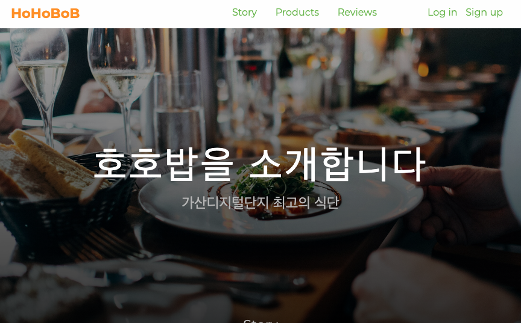

# 호호밥 (HoHoBoB)

## 요약

> 호호밥이라는 식당을 소개하는 정적 웹 페이지

## 상세

2번째 PJT

### 0. 목차

1. 소개
2. 기술 스택
3. 느낀 점
4. 기능 (페이지 구성)
5. 아쉬웠던 부분
6. 앞으로 학습할 것들, 나아갈 방향
7. 어려웠던 부분, 해결한 과정

## 1. 소개

**[호호밥 (HoHoBoB)](https://hhejo.github.io/hohobob/)**

- 호호밥이라는 식당을 소개하는 정적 웹 페이지
- 어떤 식당인지, 어떤 서비스를 하는지, 이를 위해 어떤 노력을 하는지 소개
- 어떤 제품을 제공하는지 보여줌
- 서비스 사용자들의 후기를 보여줌

작업 기간

- 2024/08, 1주

인력 구성

- 1인

## 2. 기술 스택

  

## 3. 느낀 점

- 밑바닥부터 HTML CSS(SCSS)로만 페이지를 구현하니 리액트가 얼마나 사용에 편의성을 제공하는지 느끼게 됐다
- 레이아웃을 어떻게 배치할지 고민이 많이 됐다. `div` 요소를 너무 많이 만들지 않기 위해 노력했다
- 제일 힘들었던 것은 클래스 이름을 짓고 분리하는 부분이었다
- 그래도 나름 깔끔한 디자인의 간단한 웹 사이트를 만들 수 있어 좋았다

## 4. 기능 (페이지 구성)

1. Introduce
   - 호호밥 서비스 랜딩 페이지 첫 화면
2. Story
   - 호호밥 서비스가 어떤 것이며 어떤 노력을 하는지 소개
3. Products
   - 호호밥 서비스가 어떤 것(음식)을 제공하는지 소개
4. Reviews
   - 호호밥 서비스 이용자들의 후기 모음
5. Etc
   - Nav
   - Footer

|  |                         |
| ------------------------------------------------------ | -------------------------------------------------------- |
|                 |  |

### 1. Introduce

호호밥 서비스 랜딩 페이지 첫 화면

### 2. Story

호호밥 서비스가 어떤 것이며 어떤 노력을 하는지 소개

### 3. Products

호호밥 서비스가 어떤 것(음식)을 제공하는지 소개

### 4. Reviews

호호밥 서비스 이용자들의 후기 모음

## 5. 아쉬웠던 부분

- 구현한 양이 적음. 페이지 구현도 못 함
- SCSS의 기능을 많이 사용하지 못했음. 변수 정도만 사용
- 반응형을 구현하지 못해 아쉬움

## 6. 앞으로 학습할 것들, 나아갈 방향

- CSS의 더 다양한 속성
- 미디어 쿼리 적용
- SCSS의 다양한 기능
- 이름 짓는 연습
- BEM 방식을 더 연습

## 7. 어려웠던 부분, 해결한 과정

### SCSS

`SCSS` 사용 이유

- `CSS`에서는 변수를 사용할 수 없기 때문에 `SCSS` 사용을 고려
- 선택자 중첩의 기능도 유용할 것이라고 생각
- 믹스인 기능을 통해 코드 중복 제거

`sass --watch`

- 윈도우에서 우분투 리눅스를 사용했는데 명령어가 듣지 않음
- Git Bash에서 입력하니 잘 동작함. 맥북에서도 잘 동작

### CSS

`type="text/css"`

- 작성 안 해도 상관 없음. 명시적으로 알릴 수는 있음

CSS 속성 정리

- position, overflow, white-space, background-image, transition
- background 속성 한번에 적용하는 법
- linear-gradient
- flex에도 grid에도 gap 적용 가능
- calc: 고정형과 비율을 함께 계산해주는 함수

`100%`, `100vh`

- 100%와 100vh·vw의 차이에 대해 궁금함이 생김

`padding`, `margin`

- padding과 margin 뭐를 사용해야 할지, 뭐가 나은지
- 자식, 부모 누구에게 padding을 줄지 고민
- width를 부모나 자식 누구에게 줄지 고민

`span`, `div`

- 다 div를 적용할지, 텍스트를 감싸는 것은 span으로 할지 고민
- 굳이 div 안에서 span으로 또 텍스트를 감싸야 하는지 고민

클래스

- 이름 짓기가 너무 어려움
- 뭐라고 지을지, 너무 길지 않은지, 알아볼 수 있는지 고민이 됨
- BEM 방식에 대해 공부

BEM

- 이것도 익숙하지 않아 이름 짓기 어렵고 힘들었음
- 블록, 엘리먼트는 하나씩
- 블록 안에서 엘리먼트를 어떻게 분리하고 이름을 어떻게 지을지 고민됐음

container

- div를 어떻게 구성할지 고민
- 화면 정 가운데 모든 것을 감싸는 container 필요

기타

- cascading 순서 아주 중요
- CSS 코드 길이가 너무 길어져 파일 분할

### Git

- 깃 푸시할 때 파일 크기가 너무 크면 실패함
- 이미지 때문에 파일 크기가 커질 수 있음
- git 설정을 변경해서 해결
